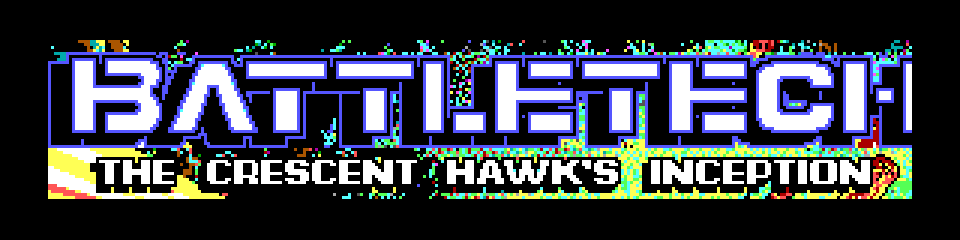
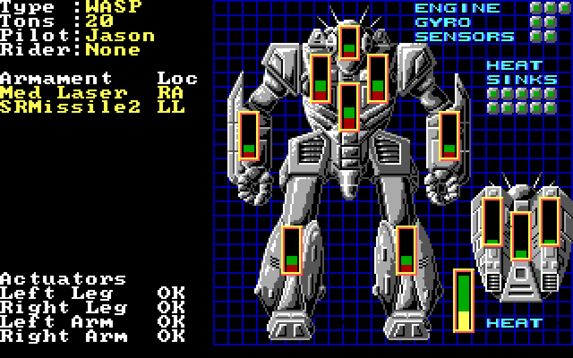

<h1 align="center">
  
</h1>

<p align="center"><em>A readable C17 reconstruction of the 1988 DOS game.</em></p>

This repository is a C17 reconstruction of the 1988 DOS game. Its purpose is
preservation: represent the executable's procedures, data, control flow and
BattleTech rules as readable C while retaining a direct route back to the
assembly evidence.

This repository starts at the consolidated v1.0 preservation snapshot. The
monorepo's development commit history is intentionally not imported.

This is not a redesign. DOS, BIOS and hardware operations are redirected at
the lowest practical boundary to SDL3 and portable host services; game logic
remains in the reconstructed procedure chain.

## Current status

Version 1.0 is supported and tested only on 64-bit Windows. The code is intended
to remain portable, but other host platforms are not release-qualified.

- The reconstructed source is divided between original logic in
  `src/Original` and platform replacements in `src/SDL`.
- The real entry point reaches the original `Setup_Game` procedure; production
  builds do not substitute a test bootstrap or replacement game loop.
- The clean v1.0 Release runs pass 117 asset-independent headless tests and 148
  SDL tests without private game data. Supplying a legal original installation
  enables 15 additional local asset-integration tests (163 total).
- Original title, map, exploration, menus, services, training, combat,
  save/load and shutdown paths have connected coverage.
- A complete manual playthrough and exact presentation/audio fidelity remain
  uncertified. See [`docs/RUNTIME_STATUS.md`](docs/RUNTIME_STATUS.md).

<p align="center">
  
</p>

## Quick start

Requirements are Windows, PowerShell, Visual Studio C/C++ build tools and a
legally obtained original game installation. CMake/Ninja are taken from Visual
Studio; SDL3 is fetched at its pinned checksum unless supplied explicitly.

Run the asset-independent Release build and tests:

```powershell
./Build.ps1 -Headless -Configuration Release
```

For local play, put the original data files in `assets/original-game` and run:

```powershell
./Run-Inception.ps1
```

Or use an installation elsewhere:

```powershell
./Run-Inception.ps1 -OriginalAssetDirectory ../Chinception
```

The direct launcher allows the game to update saves in the selected directory.
Use `-Isolated` to play from a private copy under the ignored build directory.
The old `Run.ps1` name remains as a compatibility wrapper.

## Minimal runtime package

Create a distributable runtime shell with:

```powershell
./Build.ps1 -Configuration Release -Package
```

`build-release/package` contains exactly:

```text
CrescentHawksInception.exe
CrescentHawksInception.ini
```

SDL3 is linked statically. The package contains no copyrighted game data.
`build-release/CrescentHawksInception-1.0.0-SHA256SUMS.txt` records the SHA-256
of both package files and is intentionally kept beside the package directory.
With `asset_directory=.`, both files may be copied into an original game
installation. A relative or absolute path may instead keep program and data
separate. `CHI_ASSET_DIRECTORY` overrides the file for launchers and tests.

## Repository map

| Path | Purpose |
| --- | --- |
| `src/Original` | Readable reconstruction of executable procedures and data |
| `src/SDL` | SDL3 and host implementations below DOS/hardware boundaries |
| `src/Original/*.h`, `src/SDL/*.h` | Interfaces owned by their respective source domains |
| `tests` | Behavioral, integration and preservation checks |
| `evidence` | Self-contained annotations, assembly, metadata and research |
| `docs` | Current policy, runtime status and focused conversion records |
| `tools` | Repository and package validation scripts |
| `assets/original-game` | Ignored placeholder for user-supplied original data |

The governing rules are in
[`docs/PRESERVATION_PLAN.md`](docs/PRESERVATION_PLAN.md), and directory
ownership is described in [`docs/SOURCE_LAYOUT.md`](docs/SOURCE_LAYOUT.md).
The supported DOS executable hashes are recorded in
[`docs/SUPPORTED_VERSIONS.md`](docs/SUPPORTED_VERSIONS.md).

Contributions must follow [`CONTRIBUTING.md`](CONTRIBUTING.md), particularly the
original-bug and SDL-boundary rules. Release changes are in
[`CHANGELOG.md`](CHANGELOG.md).

## Rights and licensing

Project-authored code and excluded reconstructed or third-party material are
described in [`LICENSE`](LICENSE), [`LICENSES/README.md`](LICENSES/README.md),
[`NOTICE.md`](NOTICE.md), and [`THIRD_PARTY_NOTICES.md`](THIRD_PARTY_NOTICES.md).
The original executable, game assets and private saves are not included.

This is an independent preservation and research project. It is not affiliated
with or endorsed by the game's publishers or the owners of BattleTech.
